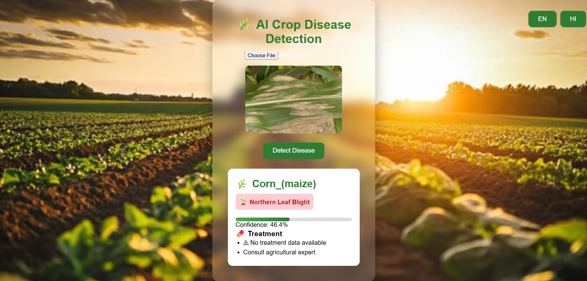
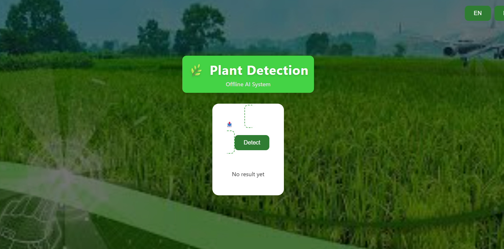
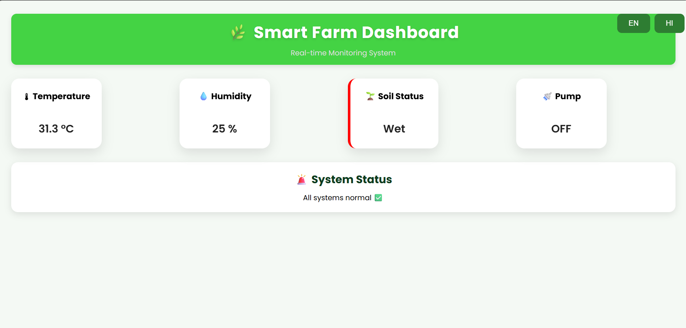
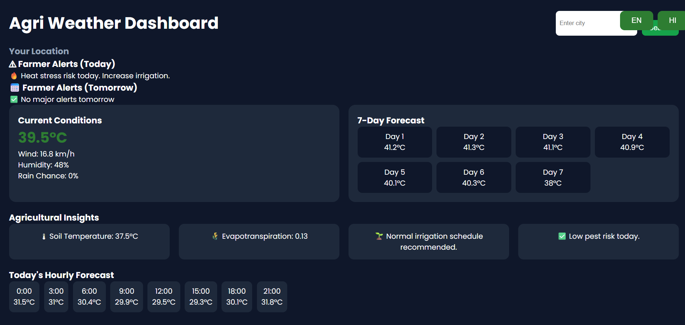
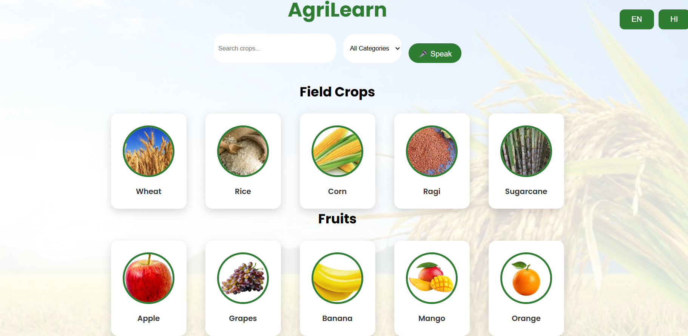
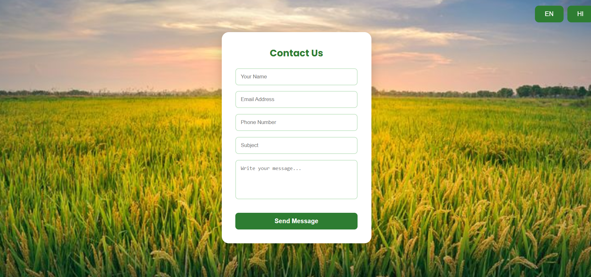

<div align="center">

# 🌱 AgriGrow

### 🚜 AI Powered Smart Farming Ecosystem

### AI • Machine Learning • IoT • Firebase • Smart Agriculture

<br>


<br><br>


### ⭐ Smart Farming for a Better Tomorrow

</div>

---

# 📑 Table of Contents

- [About](#-about)
- [Features](#-features)
- [Tech Stack](#-tech-stack)
- [Installation](#-installation)
- [Authentication System](#-authentication-system)
- [Smart Dashboard](#-smart-dashboard)
- [Crop Recommendation System](#-crop-recommendation-system)
- [AI Crop Disease Detection](#-ai-crop-disease-detection)
- [Offline Plant Detection](#-offline-plant-detection)
- [Smart Farm Monitoring](#-smart-farm-monitoring)
- [Weather Dashboard](#-weather-dashboard)
- [AgriLearn](#-agrilearn)
- [Contact Module](#-contact-module)
- [Firebase Integration](#-firebase-integration)
- [IoT Smart Farming Prototype](#-iot-smart-farming-prototype)
- [Future Enhancements](#-future-enhancements)
- [Developer Info](#-developer-info)
# 📖 About

AgriGrow is an AI-powered Smart Agriculture platform designed to assist farmers using **Machine Learning, Artificial Intelligence, IoT, and Firebase**.

The platform combines multiple smart farming technologies into a single ecosystem that helps farmers improve crop quality, monitor farms remotely, and make intelligent agricultural decisions.

---

# ✨ Features

* 🌾 AI Crop Recommendation
* 🍃 AI Crop Disease Detection
* 🌱 Offline Plant Detection
* 📡 Smart Farm Monitoring
* ☁ Weather Forecast Dashboard
* 📚 AgriLearn Educational Platform
* 🔐 Firebase Authentication
* 📬 Contact & Feedback System
* 🤖 IoT Integration

---

# 🛠 Tech Stack

## Frontend

* React.js
* HTML5
* CSS3
* JavaScript

## Backend

* Python
* Flask

## Machine Learning

* TensorFlow
* Scikit-Learn
* NumPy
* Pandas

## Database

* Firebase Firestore
* Firebase Realtime Database

## Authentication

* Google Login
* Mobile OTP Login
* Firebase Authentication

## Hardware

* ESP32
* Soil Moisture Sensor
* DHT Sensor
* Relay Module
* Water Pump

---

# 🔐 Authentication System

Secure login system built with Firebase.

### Features

* Google Authentication
* Mobile OTP Login
* Secure User Storage
* Firebase Authentication

<p align="center">

</p>

---

# 🏠 Smart Dashboard

Central hub for accessing all smart farming modules.

### Includes

* Quick Navigation
* Farmer Services
* AI Modules
* Smart Monitoring

<p align="center">

</p>

---

# 🌾 Crop Recommendation System

Machine Learning model that predicts the most suitable crop.

### Prediction Parameters

* Nitrogen
* Phosphorus
* Potassium
* Temperature
* Humidity
* pH
* Rainfall

<p align="center">

</p>

---

# 🍃 AI Crop Disease Detection

Upload a crop image and let AI detect diseases.

### Features

* Image Upload
* Disease Prediction
* Confidence Score
* Treatment Suggestion

<p align="center">

</p>

---

# 🌱 Offline Plant Detection

Detect plants without requiring internet connectivity.

### Advantages

* Fast Prediction
* Offline AI Model
* Easy to Use

<p align="center">

</p>

---

# 📡 Smart Farm Monitoring

Real-time farm monitoring using IoT sensors.

### Monitors

* Temperature
* Humidity
* Soil Moisture
* Water Pump Status
* Farm Activity

<p align="center">

</p>

---

# ☁ Weather Dashboard

Smart weather forecasting system for farmers.

### Features

* Current Weather
* Hourly Forecast
* Weekly Forecast
* Weather Alerts
* Agricultural Insights

<p align="center">

</p>

---

# 📚 AgriLearn

Agriculture education and information portal.

### Modules

* Crops
* Fruits
* Search System
* Voice Assistance

<p align="center">

</p>

---

# 📬 Contact Module

Users can directly send feedback and queries.

### Features

* Firebase Storage
* Contact Form
* Farmer Support

<p align="center">

</p>

---

# 🔥 Firebase Firestore

Stores application data securely.

<p align="center">

</p>

---

# 🔐 Firebase Authentication Database

Stores authenticated user information.

<p align="center">

</p>

---

# 📡 Firebase Realtime Database

Real-time IoT sensor data collection.

<p align="center">

</p>

---

# 🤖 IoT Smart Farming Prototype

Hardware implementation of AgriGrow.

### Components

* ESP32
* Soil Moisture Sensor
* DHT Sensor
* Relay Module
* Water Pump

<p align="center">

</p>

---

# 🤖 Machine Learning Models

### Crop Recommendation

Predicts the best crop using soil and climate data.

---

### Disease Detection

Deep Learning model for crop disease identification.

---

### Offline Plant Detection

Fast AI model for plant classification.

---

# 🌍 Future Enhancements

* AI Chatbot
* Mobile Application
* Drone Monitoring
* Satellite Crop Analysis
* Smart Irrigation
* Marketplace Integration

---
# 🚀 Installation

## Clone Repository

```bash
git clone https://github.com/Kartiksinghparihar/Agrigrow.git
```

## Frontend

```bash
npm install

npm start
```

## Backend

```bash
cd backend

python -m venv venv

venv\Scripts\activate

pip install -r requirements.txt

python app.py
```

---

# 👨‍💻 Developer Info

<div align="center">

<table>

<tr>

<td align="center">


<h2>Kartik Singh Parihar</h2>

<h3>Full Stack Developer</h3>

<a href="YOUR_LINKEDIN">

</a>

<a href="https://github.com/Kartiksinghparihar">

</a>

<a href="mailto:YOUR_EMAIL">

</a>

</td>

<td align="center">


<h2>Second Developer</h2>

<h3>ML & IoT Developer</h3>

<a href="LINKEDIN">

</a>

<a href="GITHUB">

</a>

<a href="mailto:EMAIL">

</a>

</td>

</tr>

</table>

</div>
## ⭐ Support

If you like this project, please give it a star on GitHub.

### 🌱 Made with ❤️ for Smart Farming and Sustainable Agriculture 🚜

</div>
